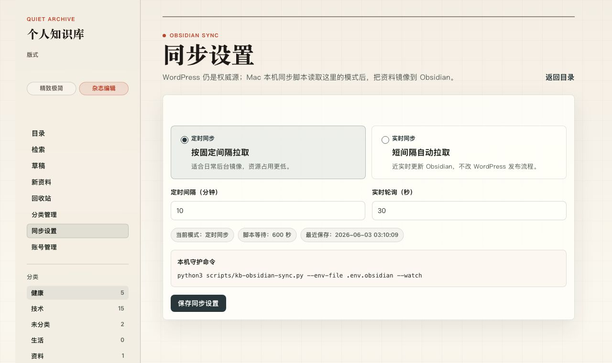

# Personal KB WordPress Stack · 个人知识库自托管部署栈


一个适合个人和家庭自托管的知识库网站部署包：WordPress + MariaDB + Caddy + Cloudflare Tunnel + 手机分享发布 + 内容导入 + 备份恢复 + Obsidian 单向同步。

默认示例域名使用 `kb.example.com` 和 `family.example.com`。真实域名、数据库密码、Cloudflare Tunnel token、DNS API key、WordPress Application Password 和 SSH key 都应只保存在本地 `.env`、服务器 `.env` 或 `secrets/` 中，不应提交到 Git。

> 推荐发布方式：GitHub 作为主仓库，Gitee 作为国内访问镜像。日常只维护 GitHub，再从 Gitee 导入或同步。

## 30 秒本地开始

本地测试只会启动个人知识库，不会连接生产服务器：

```bash
./scripts/make-kb-local-env.sh
./scripts/init-kb-local.sh
```

打开：

```text
http://localhost:8080/wp-login.php
```

常用本地命令：

```bash
./scripts/kb-local-compose.sh ps
./scripts/kb-local-compose.sh logs -f kb-wordpress-local
./scripts/kb-local-compose.sh down
```

## 效果预览




## 适合 / 不适合

适合：

- 想把链接、资料、长文归档、家庭资料沉淀成一个私有知识库。
- 想用 WordPress，但不想从零配置 Docker、反代、安全策略、备份和初始化脚本。
- 家里有 Debian/Ubuntu 服务器、NAS、PVE VM、VPS 或任意可运行 Docker 的 Linux 主机。
- 希望用 Cloudflare Tunnel 访问家中服务，不想暴露家庭公网入站端口。
- 希望从手机分享菜单、URL、HTML 文件或本地笔记快速发布到知识库。

不适合：

- 只想要一个纯静态博客。
- 不想维护服务器、Docker、域名和备份。
- 需要多人企业级权限、审计和复杂工作流的团队知识库。
- 希望把真实内容、密钥、备份和个人恢复资料一起开源。

## 功能

- 个人知识库站点，可选家庭站点。
- Caddy 反向代理和安全响应头。
- Cloudflare Tunnel、直连 HTTPS、边缘中转三种部署思路。
- WordPress 初始化脚本，自动创建用户、分类、主题和 Application Password。
- 登录保护、匿名 REST 拦截、`xmlrpc.php` 禁用、私有归档 shortcode。
- URL/HTML 导入、图片搬运、手机分享发布、视频发布辅助脚本。
- Obsidian 单向镜像同步，把 WordPress 帖子导出成本地 Markdown。
- 数据库、uploads、插件和站点配置备份与恢复。

## 部署路线

推荐优先使用 Cloudflare Tunnel：

```bash
less docs/KB_CLOUDFLARE_TUNNEL_DEPLOY.md
```

完整安装入口：

```bash
less docs/INSTALL.md
```

上线后的内容推送、备份恢复和安全巡检：

```bash
less docs/KB_OPERATIONS.md
```

其他路线：

- 直连 HTTPS 部署：[docs/KB_PRODUCTION_DEPLOY.md](docs/KB_PRODUCTION_DEPLOY.md)
- 公网边缘中转部署：[docs/KB_RELAY_DEPLOY.md](docs/KB_RELAY_DEPLOY.md)
- 双站点部署：[docs/DEPLOY.md](docs/DEPLOY.md)
- 手机分享发布：[docs/KB_MOBILE_SHORTCUT.md](docs/KB_MOBILE_SHORTCUT.md)、[docs/KB_ANDROID_SHARE.md](docs/KB_ANDROID_SHARE.md)

## 安全边界

- `.env`、`.env.*`、`secrets/` 不进入 Git。
- `private/`、`incoming/`、`backups/`、`prepared-media/` 是本机或运行数据，不进入公开仓库。
- 默认文档只使用 `example.com`、`your-server.example.com`、`<VM_IP>` 这类占位。
- 本机私有网盘备份工作流属于个人恢复方案，不进入开源仓库。
- 单篇公开分享、登录保护、REST 拦截、`xmlrpc.php` 禁用和基础安全头由 MU 插件与 Caddy 配合实现。

开源前扫描清单见：[docs/GITEE_OPEN_SOURCE.md](docs/GITEE_OPEN_SOURCE.md)。

## GitHub / Gitee

仓库名：

```text
personal-kb-wordpress-stack
```

推荐发布方式：

- GitHub 主仓库：正式提交、版本和主要协作。
- Gitee 国内镜像：方便国内用户浏览和克隆。
- 日常只推送 GitHub，再在 Gitee 触发导入或同步。

完整发布步骤见：[docs/PUBLISH_GITHUB_GITEE.md](docs/PUBLISH_GITHUB_GITEE.md)。

当前发布地址：

```markdown
主仓库：<https://github.com/sparkle1968/personal-kb-wordpress-stack>
国内镜像：导入 Gitee 后补充
```

## 目录

- `compose*.yml`：不同部署模式的 Docker Compose 文件。
- `caddy/`：Caddy 配置和带 AliDNS 插件的构建文件。
- `themes/kanso-minimal/`：知识库主题。
- `mu-plugins/`：登录保护、分享链接、来源字段和安全策略。
- `scripts/`：初始化、导入、发布、同步、备份、恢复和巡检脚本。
- `docs/`：安装、部署、运维、移动端分享和排障文档。
- `android/`、`shortcuts/`：移动端分享发布模板。
- `systemd/`：服务器端定时备份和 DDNS timer 模板。

## 许可证

本项目按 `GPL-2.0-or-later` 发布，和仓库内 WordPress 主题的许可声明保持一致。
